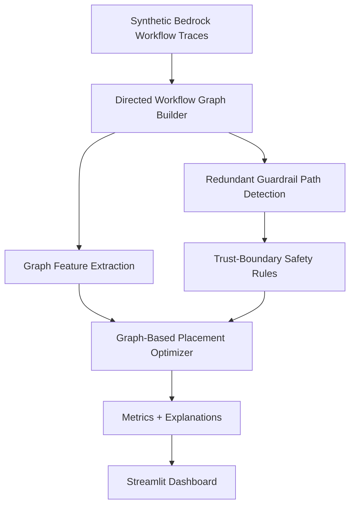
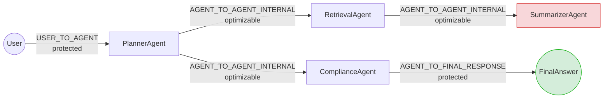

# Bedrock Guardrail Graph Optimizer

[](.github/workflows/ci.yml)

**The problem:** Amazon Bedrock Guardrails and AgentCore Policy decide *what*
to check, not *where in a multi-agent execution graph* a check should run --
so teams either run every guardrail at every hop (inflating latency and
cost) or strip checks out by hand in a way that's hard to audit. **This
project's mechanism:** it models each Bedrock-style workflow as a real
directed graph (agents, tools, user, final response as nodes; handoffs as
edges with attached guardrail checks) and walks every path -- including
dead-end branches -- to find genuinely redundant checks, never a flat
row-level scan. **The one number that matters:** on the default mixed
corpus this recovers a real ~6-10% guardrail call reduction at
**100% protected-boundary and high-risk preservation**, and up to ~30% on
scenarios with more redundant internal hops (see [BENCHMARKS.md](BENCHMARKS.md))
-- the safety guarantee, not the percentage, is the point.

> **This project does not replace Amazon Bedrock Guardrails.** It simulates
> an orchestration layer for Bedrock-style multi-agent workflows. It does
> not call live AWS APIs. See "Known Limitations" below.

---

## 1. Why this project exists

Amazon Bedrock provides Guardrails, AgentCore Policy, and other safety controls. Those controls decide *what* to check. They do not decide *where in a multi-agent workflow* a check should run. As Bedrock-style workflows grow more agentic -- planners handing off to retrieval agents, tools, and summarizers before a final response -- teams tend to either:

- run every guardrail check at every hop, inflating latency and cost, or
- strip out checks by hand in a way that is hard to audit and easy to get wrong.

## 2. The operational gap

Neither extreme is acceptable at production scale. What's missing is a way to reason about guardrail placement across an entire multi-agent execution graph -- not just within a single request/response pair.

## 3. What this project does

This repo models each simulated Bedrock-style workflow as a **directed graph**: agents, tools, the user, and the final response are nodes; handoffs between them are edges; guardrail checks attach to the edges they run on. It then:

1. Enumerates every path through the graph -- both real UserInput -> FinalAnswer paths *and* dead-end orphan branches that never reach a final node (see `all_paths_with_types()` in `graph_builder.py`). Every edge in the graph is guaranteed to be covered by at least one enumerated path.
2. Walks each path in execution order looking for a guardrail check that repeats.
3. Classifies each repeat against a config-driven safety policy (trust boundary, risk level, text/policy drift, prior result, orphan-branch status).
4. Recommends **KEEP**, **REUSE_PREVIOUS_DECISION**, **SKIP_REDUNDANT_WITH_AUDIT**, **MOVE_TO_BOUNDARY**, or **HUMAN_REVIEW_REQUIRED** for every check.
5. Reports graph-level metrics (path counts, redundancy ratios, a transparent rule-based risk score) alongside call/latency/cost savings.

## 4. Why graph-based optimization matters

A duplicate guardrail check only matters in the context of the path it sits on. The same `PII_CHECK` running twice on two *unrelated* branches of a workflow is not redundant -- it's two independent protections. Two occurrences on the *same* path, with the same policy and unchanged text, is a genuine candidate for optimization. Row-level duplicate detection cannot tell these apart; graph-path-aware detection can.

This also has to hold up under a specific failure mode: a workflow can have
**both** a real path to `FinalAnswer` **and** a separate dead-end branch in
the same graph (e.g. `Planner -> Retrieval -> Summarizer`, which never
reconnects, alongside `Planner -> Compliance -> FinalAnswer`, which does).
Naive path enumeration that only walks root-to-final paths silently drops
every check on the dead branch. This repo's `all_paths_with_types()` fix
guarantees every edge -- dead branch included -- is covered by at least one
enumerated path, and orphan-branch checks are routed through the same
decision engine with a `blocked_by="orphan_branch"` reason, conservatively
downgraded to `KEEP` if they'd otherwise be optimized away. See
`tests/test_plan_integrity.py` for the regression test that guards this.

## 5. Architecture



## 6. Example workflow graph (with trust boundaries)



This is the `orphan_branch_mixed` scenario shape: `Retrieval -> Summarizer`
(red) is a dead-end orphan branch that never reaches `FinalAnswer`; the
`Planner -> Compliance -> FinalAnswer` branch (green) is the real path.
Both are walked and accounted for.

## 7. Optimizer decisions

| Decision | Meaning |
|---|---|
| `KEEP` | Check runs as-is. Always used for protected boundaries, high risk, and (as a conservative default) orphan-branch dead ends. |
| `REUSE_PREVIOUS_DECISION` | Prior decision reused with an audit trail (medium-risk internal duplicates). |
| `SKIP_REDUNDANT_WITH_AUDIT` | Duplicate check skipped, with a recorded audit trail (low-risk internal duplicates only). |
| `MOVE_TO_BOUNDARY` | Recommends adding a check at a boundary that currently has none (e.g. a missing final-response check). |
| `HUMAN_REVIEW_REQUIRED` | High risk, conflicting results, or other uncertainty -- never auto-optimized. |

## 8. Safety rules

- **Protected trust boundaries are always kept**: `USER_TO_AGENT`, `AGENT_TO_TOOL`, `TOOL_TO_AGENT`, `AGENT_TO_FINAL_RESPONSE`.
- **High risk is never silently skipped** -- kept or escalated to human review.
- **Text mutation, policy drift, or a prior WARN/BLOCK result** always block reuse.
- **Conflicting results for the same guardrail key** escalate to human review.
- **Orphan/dead-end branches never silently drop their checks** -- they're routed through the full decision engine, with any would-be optimization conservatively downgraded to `KEEP`.
- Every reuse or skip carries `reused_from_step_id` and `audit_required=True`.
- Rules are defined in [`config/guardrail_policy.yaml`](config/guardrail_policy.yaml), not hardcoded.
- `graph_metrics.py` enforces a hard gate: if any protected-boundary check or any high-risk check is ever marked as skipped in the plan, `compute_metrics()` raises `RuntimeError` rather than reporting a silently-unsafe result.

## 9. Scenario library (Part 2.4)

Instead of one generic random generator, `synthetic_workflows.py` includes six named, independently runnable/testable multi-agent workflow archetypes:

| Scenario | Shape | Purpose |
|---|---|---|
| `rag_customer_support` | Retrieval -> Compliance -> Final | Common production RAG support-agent shape |
| `financial_advisory` | Planner -> 2 parallel tool calls -> Aggregator -> Compliance -> Final | Fan-out/fan-in multi-tool agent |
| `code_generation` | Planner -> CodeGen tool -> Reviewer agent -> Final | No internal agent-to-agent hops at all -- proves 0% reduction is sometimes correct |
| `healthcare_triage` | Planner -> Triage -> Compliance -> Final, all forced high-risk | Proves nothing gets skipped under maximum risk pressure |
| `long_chain` | 6+ agent hops | Stress-tests path enumeration / performance |
| `malformed_workflow` | Missing final boundary + orphan branch + mid-path policy drift, combined | Proves the safety rules hold under compounded failure modes |

Run any scenario independently:

```bash
python src/synthetic_workflows.py --scenario healthcare_triage --workflows 20
python src/run_pipeline.py --scenario healthcare_triage --workflows 20
python src/synthetic_workflows.py --list-scenarios
```

See [BENCHMARKS.md](BENCHMARKS.md) for measured call-reduction/latency-saved numbers per scenario.

## 10. Graph metrics

Computed per workflow (see `outputs/workflow_graph_summary.csv`): node/edge/path counts, protected boundary count, internal handoff count, total and duplicate guardrail calls, redundant internal checks, high-risk node/edge counts, missing-final-boundary flag, policy drift and text mutation counts, guardrail density, boundary coverage, internal redundancy ratio, and a transparent, rule-based `graph_risk_score`.

Every run also writes [`outputs/scenario_metrics.csv`](outputs/scenario_metrics.csv): the same aggregate call-reduction / latency-saved / cost-saved / boundary-coverage / high-risk-preservation metrics reported in the terminal summary and `outputs/guardrail_metrics.json`, but broken out per synthetic scenario (workflow template) instead of aggregated across the whole corpus -- columns `scenario, workflow_count, original_guardrail_calls, optimized_guardrail_calls, call_reduction_percent, latency_saved_percent, cost_saved_percent, boundary_coverage_percent, high_risk_preservation_percent`. See BENCHMARKS.md for a worked example and how to read negative per-scenario numbers.

## 11. Dashboard

Run the Streamlit dashboard (`streamlit run src/app.py`) for: an overview of savings and safety metrics, a per-workflow graph explorer with node/edge tables and a rendered directed graph, redundant-path analysis, the full optimized plan with filters, the boundary coverage matrix, a graph risk leaderboard, and plain-language explanation cards.

## 12. How to run

```bash
# Local
pip install -r requirements.txt
python src/run_pipeline.py
python src/run_pipeline.py --workflows 500 --seed 42
python src/run_pipeline.py --workflows 500 --strict-mode
python src/run_pipeline.py --scenario financial_advisory --workflows 20
python src/run_pipeline.py --workflows 10000 --verbose   # scale benchmark, see BENCHMARKS.md
pytest -q
mypy src
streamlit run src/app.py

# Or, one command with Docker (no local Python env needed):
docker compose up
```

`--strict-mode` disables `SKIP_REDUNDANT_WITH_AUDIT` entirely; only `REUSE_PREVIOUS_DECISION` is allowed for low/medium-risk internal duplicates, and everything else escalates to `HUMAN_REVIEW_REQUIRED`.

`--verbose` enables structured DEBUG-level logging (via the standard `logging` module, not print statements) showing per-stage timing: graph construction -> feature extraction -> redundant-path detection -> optimization -> metrics -> explanations.

## 13. Example output

```
Generated workflows: 501
Graph nodes: 3,052
Graph edges: 2,658
Original guardrail calls: 3,561
Optimized guardrail calls: 3,237
Guardrail call reduction: 9.1%
Latency saved: 9.33%
Estimated cost saved: 8.59%
Redundant graph paths detected: 3,053
Redundant paths optimized: 550
Blocked by safety rules: 943
Boundary coverage preserved: 100.0%
High-risk checks preserved: 100.0%
Human review cases: 766
```

Actual numbers vary with `--workflows`, `--seed`, and `--scenario` (see [BENCHMARKS.md](BENCHMARKS.md) for a fuller breakdown, including the 10,000-workflow scale run and the per-scenario comparison table). Every run also writes [`outputs/scenario_metrics.csv`](outputs/scenario_metrics.csv), the same call-reduction/latency/cost/safety metrics broken out per scenario (workflow template) instead of aggregated -- see BENCHMARKS.md for a worked example.

## 14. Known Limitations

- **This is a simulation.** It does not call live Amazon Bedrock Guardrails, AgentCore Policy, or any other AWS API. All workflow traces are synthetic (`src/synthetic_workflows.py`). There is no public dataset of real Bedrock production traces to substitute in -- Bedrock Agent traces (`InvokeAgent` with `enableTrace=true`) and Guardrail assessments (`ApplyGuardrail`) are account-specific and only exist once you invoke your own Bedrock Agents/Guardrails with logging enabled. `src/bedrock_log_adapter.py` provides a format-transformer (JSON in, internal-schema CSV out, no AWS calls) for anyone who wants to point the existing graph pipeline at a real exported trace instead of the synthetic generator -- see the "Real data" section below.
- **Orphan/dead-end branches** (hops that never reach `FinalAnswer`) are enumerated and routed through the full decision engine via `all_paths_with_types()` in `graph_builder.py`, but any would-be optimization on them is conservatively downgraded to `KEEP` -- they are never allowed to silently disappear from the plan. See `tests/test_plan_integrity.py`.
- **The cost/latency model is illustrative**, calibrated against publicly documented Amazon Bedrock Guardrails pricing ($0.15 per 1,000 text units for content-filter/denied-topic policies, per the official AWS Bedrock pricing page, checked July 2026) and latency (guardrail policies evaluated in parallel per AWS's own docs, with field reports putting a single policy evaluation at roughly 100-300ms) -- see the calibration comment block in `config/guardrail_policy.yaml` for full sourcing. It is not measured against a live AWS account.
- **The headline savings number is a real, scenario-dependent measurement**, not a cherry-picked best case. On the default mixed corpus, call reduction is roughly 6-10% (the random template pool is weighted toward the templates with the most internal hand-offs -- see BENCHMARKS.md); some archetypes (`long_chain`, `rag_customer_support`) show up to ~30-38%; others (`code_generation`, `healthcare_triage`) correctly show 0% because there's genuinely nothing safe to optimize; `malformed_workflow` shows *negative* reduction because fixing a missing safety boundary costs more calls, not fewer. See [BENCHMARKS.md](BENCHMARKS.md) for the full, unfiltered table, and [`outputs/scenario_metrics.csv`](outputs/scenario_metrics.csv) for the same breakdown from your own run.
- **Duplicate detection walks each simple path independently**; a check that sits on an edge shared by multiple branches (e.g. a converging summarizer) is evaluated once per branch context and de-duplicated for reporting, which is a simplification of true multi-path state sharing.
- **No ML-based prioritization is used anywhere in this repo.** Every decision traces back to an explicit, inspectable rule in `graph_optimizer.py`'s `_decide_step()` / `_classify_duplicate()`, gated by the hard safety checks in `graph_metrics.py::compute_metrics()`. There is nothing to "override" deterministic safety rules because nothing but those rules makes the decision.
- **Known scaling bottleneck:** at 10,000 workflows, `build_all_workflow_graphs` accounts for ~95% of total wall-clock time because it filters the full trace DataFrame once per `(workflow_id, request_id)` pair rather than using a single `groupby`. See [BENCHMARKS.md](BENCHMARKS.md) for the measured numbers; a groupby-based rewrite is filed as future work, not silently omitted.
- Rule-based optimizer; not formally verified.
- Not intended to remove production security controls without human approval.

## 15. Future work

- Extend `src/bedrock_log_adapter.py` to cover more real Bedrock trace shapes (multi-agent collaboration traces, additional Guardrails policy types) beyond the current mapping.
- Formal policy verification.
- Real guardrail latency/cost measurements against a live AWS account.
- `groupby`-based rewrite of `build_all_workflow_graphs` to remove the O(n^2)-ish scaling bottleneck documented above.
- Interactive graph visualization UI.
- Human approval workflow integration.
- Enterprise-configurable guardrail policies.
- Support for OpenTelemetry traces.

## 16. Real data (adapter, not integration)

The current version uses synthetic Bedrock-style traces because real Bedrock/AgentCore traces are account-specific and not publicly available -- there is nothing to download. The graph pipeline (`graph_builder.py` / `graph_optimizer.py` / `graph_metrics.py`) is schema-driven, so it runs unmodified against any trace data in the internal CSV format, whether that data came from `synthetic_workflows.py` or somewhere else.

`src/bedrock_log_adapter.py` is that "somewhere else": a pure JSON-to-CSV format transformer (no `boto3`, no AWS calls) that normalizes a Bedrock-style trace export -- shaped after `InvokeAgent`'s `enableTrace=true` trace events and `ApplyGuardrail`'s assessment format -- into the same schema the rest of the pipeline already expects. A worked example is in [`sample_uploads/sample_bedrock_trace.json`](sample_uploads/sample_bedrock_trace.json).

```bash
python src/bedrock_log_adapter.py \
    --input sample_uploads/sample_bedrock_trace.json \
    --out data/real_bedrock_trace.csv
```

If you want to run this against your own real data instead of the sample:

1. Create/invoke a Bedrock Agent in your own AWS account.
2. Invoke it with `enableTrace=true` and capture the trace events.
3. Apply a Bedrock Guardrail (`ApplyGuardrail`) and capture its `assessments`.
4. Optionally enable Bedrock model invocation logging to CloudWatch/S3.
5. Export those logs to a JSON file shaped like `sample_bedrock_trace.json`.
6. Run the adapter command above, then point `graph_builder.build_all_workflow_graphs()` at the resulting CSV the same way `run_pipeline.py` does for synthetic data.

**What the adapter does not do:** it does not call AWS, it does not fetch anything on your behalf, and its field mappings are explicit approximations documented at the top of the module -- e.g. `trust_boundary` is derived from the trace event type (which real traces do have), while `risk_level` falls back to a keyword heuristic only when your trace doesn't supply an explicit risk tag, since Bedrock traces don't carry a business risk classification natively. Treat its cost/confidence outputs as placeholders, not calibrated figures, until you substitute your own account's pricing and thresholds.

---

See [`MODEL_CARD.md`](MODEL_CARD.md) for a summary of what this system is (and is not) intended for, and [`BENCHMARKS.md`](BENCHMARKS.md) for full measured results.
